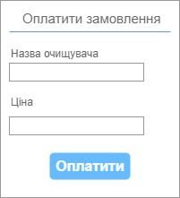

| NFR ID | Test Case ID | Опис кроків тестового сценарію | Опис очікуваних результатів |
| ------ | ------------ | ------------------------------ | --------------------------- |
| NFR1.1 | TC1.6 | Початкові умови: відсутні.  Кроки сценарію: відсутні. | Екранна форма:   |
| NFR1.1 | TC1.7 | Початкові умови: успішно пройдено TC1.6.  Кроки сценарію:  1) В поле "Назва очищувача" внесено значення "Очищувач А228"  2) В поле "Ціна" внесено значення "100"  | Екранна форма:   |
| NFR1.1 | TC1.8 | Початкові умови: успішно пройдено TC1.7.  Кроки сценарію:  1) Натиснуто кнопку "Оплатити" | Екранна форма:   |
